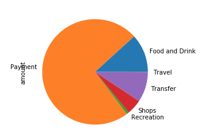
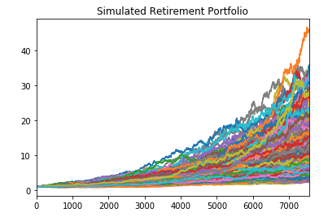

# Applications


## Background

The consumer division of Harold's company has decided to offer budgeting and financial planning services to customers. They want to build a report for customers that links to their banking and investment accounts and automatically refreshes the data and charts on login. However, some of the calculations are tricky, and Harold could really use some help connecting the accounts and simulating the retirement investment projections. Luckily, there are APIs available to obtain account transactions and fetch retirement portfolio prices.

In this Activity, I help Harold complete the following tasks:

1. [Budget Analysis with Plaid](#Budget-Analysis)
2. [Retirement Planner](#Retirement-Planner)
3. [Financial Report](#Financial-Report)

- - -

### Contents

#### Budget Analysis

In this section, I use the Plaid API to obtain transaction and account data for the budget analysis section of the report.


1. Generate a Plaid access token to access the Developer Sandbox.

2. Use the Access token to fetch account transactions from the sandbox. You should fetch the last 90 days of transactions from the sandbox using the following institution:

    ```python
    INSTITUTION_ID = "ins_109508"
    ```

3. Perform basic budget analysis on the sandbox transaction and generate the following plots:

* Spending Categories Pie Chart

  

* Spending Per Month Bar Chart

  

4. Use the API to fetch income data from the sandbox and print the following:

* Last Year's Income Before Tax

* Current Monthly Income

* Projected Year's Income Before Tax

#### Retirement Planner

In this section, I use the Alpaca API to fetch historical closing prices for a retirement portfolio and then run Monte Carlo simulations to project the portfolio performance at 30 years. I then use the Monte Carlo data to answer questions about the portfolio.

##### Monte Carlo Simulation


1. Use the Alpaca API to fetch historical closing prices for a traditional 60/40 portfolio using the `SPY` and `AGG` tickers to represent the 60% stocks (SPY) and 40% bonds (AGG).
2. Run a Monte Carlo Simulation of 500 runs and 30 years for the 60/40 portfolio and plot the results.

    

3. Select the ending cumulative returns from the Monte Carlo simulation and calculate the interval values for a 90% confidence interval.
4. Using the ending cumulative returns, plot a histogram of the results and plot the 90% confidence interval as vertical lines on the histogram.

    

##### Retirement Analysis

Use the Monte Carlo simulation data to determine the following information:

1. The expected cumulative returns at 30 years for the 10th, 50th, and 90th percentiles.
2. The expected return in dollars at the 10th, 50th, and 90th percentiles, given an initial investment of $20,000.
3. Given the current projected annual income from the Plaid analysis, will a 4% withdrawal rate meet or exceed that value at the 10th percentile? 
4. How would a 50% increase in the initial investment amount affect the 4% retirement withdrawal? 
5. Use the Monte Carlo data and calculate the cumulative returns at the 5%, 50%, and 95% quartiles and plot this data as a line chart to see how the cumulative returns change over the life of the investment.

    

#### Financial Report

In this section, I compiled a financial report to demo my calculations to the consumer app team. The report is written as a markdown file and includes the following sections:

1. Budget Analysis: Summarized the transaction data from the budget analysis and included images for each chart and table produced.
2. Retirement Planning: Summarized the retirement portfolio analysis and included the charts for the Monte Carlo simulation.

#### Optional Challenge — Early Retirement

Harold was really impressed with the work on this planner, but commented that 30 years seems like such a long time to wait to retire! Harold starts wondering if the retirement plan could be adjusted to retire earlier than normal. I tried adjusting the portfolio to either include more risk (a higher stock than bond ratio) or to have a larger initial investment and rerun the retirement analysis to see what it would take to retire in five years instead of 30!

- - -

### Resources

[Mastering Markdown](https://guides.github.com/features/mastering-markdown/)

[Plaid API Docs](https://plaid.com/docs/)

[Alpaca Financial API Docs](https://alpaca.markets/docs/api-documentation/)

- - -
